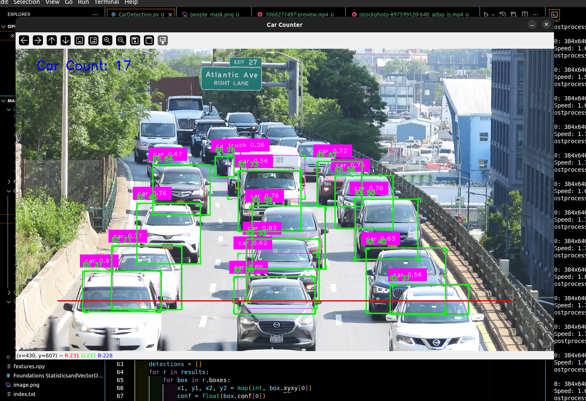
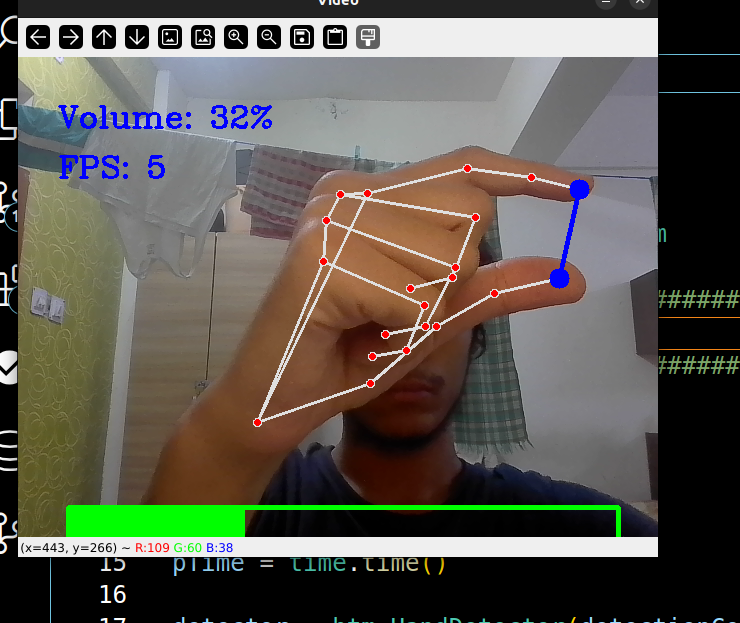

# **Computer Vision Projects**

Welcome to the **cv-projects** repository, a collection of Python-based computer vision applications designed to showcase different AI-driven use cases in the field of computer vision. These projects are built to handle real-time tasks like car detection, finger counting, virtual control, and more. This repository also features hands-on modules for pose and hand tracking.


**GitHub:** [https://github.com/PranjalKumar09/cv-projects](https://github.com/PranjalKumar09/cv-projects)  
**Email:** [coderkumarshukla@gmail.com](mailto:coderkumarshukla@gmail.com)  
**Docker Image:** `pranjalkumar09/computer_vision_projects:latest`

---

## **Table of Contents**

1. [Project Overview](#project-overview)
2. [Technology Stack](#technology-stack)
3. [Modules & Scripts](#modules--scripts)
4. [Static Assets](#static-assets)
5. [Deployment](#deployment)
6. [Installation](#installation)
7. [Contributing](#contributing)
8. [License](#license)

---

## **Project Overview**




This repository contains several AI-driven computer vision applications that interact with the real world, including:

- **Car Detection**  
- **Finger Counting**  
- **Virtual Control (Mouse & Painter)**  
- **Person Counting**  
- **Personal AI Trainer**  
- **Hand and Pose Tracking**  

These applications utilize a range of modern computer vision techniques, from image segmentation to real-time tracking, and offer insights into integrating AI into practical applications.




---

## **Technology Stack**

- **Programming Languages:** Python
- **Libraries:** OpenCV, TensorFlow, Keras, NumPy, time, OS
- **Deployment:** Docker, Kubernetes (K8s)
- **AI Models:** Custom-trained models for detection and tracking tasks
- **Containerization:** Docker
- **Cloud/Orchestration:** Kubernetes
- **Version Control:** Git

---

## **Modules & Scripts**

### 1. **src/CarDetection.py**
Detects and counts the number of cars in a given video or image stream. This application uses a pre-trained object detection model.

### 2. **src/ControllingVolume.py**
Uses hand gestures to control the volume of your system. This application utilizes hand tracking to map gestures to volume controls.

### 3. **src/CountingFingers.py**
Detects and counts the number of fingers being shown in real-time. It uses hand tracking to identify the number of fingers.

### 4. **src/hand_tracking_module.py**
This module enables real-time hand tracking, used in several applications in this repository (e.g., finger counting and virtual mouse).

### 5. **src/PersonalAITrainer.py**
A personal AI trainer module designed for fitness and exercise tracking using pose detection to give feedback on exercise form.

### 6. **src/PersonCounter.py**
Counts the number of people in a frame, ideal for applications in security and crowd management.

### 7. **src/pose_module.py**
This module tracks human body poses and is used for applications like fitness and personal training, and human motion analysis.

### 8. **src/VirtualMouse.py**
Controls your mouse cursor using hand gestures. It tracks the position of your hand to move and click on the screen.

### 9. **src/virtualPainter.py**
Transforms your hand gestures into drawing actions on a virtual canvas, allowing you to "paint" using gestures.

---

## **Static Assets**

The `static/` folder contains various assets such as images, videos, and masks used for testing and UI purposes. Examples include:

- **static/image.png, static/image2.png:** Example images for testing.
- **static/5229647-uhd_3840_2160_30fps.mp4:** Sample video file used for car detection and other applications.
- **static/people_mask.png, static/car_count_mask.png:** Masks used for image processing and detection tasks.

---

## **Deployment**

This project supports deployment via **Docker** and **Kubernetes**.

### Docker Deployment:
You can deploy the project using the pre-built Docker image available at `pranjalkumar09/computer_vision_projects:latest`. The project comes with a **Dockerfile** and **deployment.yaml** files to help you get started quickly.

To build and run the Docker container:
```bash
docker build -t pranjalkumar09/computer_vision_projects .
docker run -p 5000:5000 pranjalkumar09/computer_vision_projects:latest
```

### Kubernetes Deployment:
For Kubernetes users, the repository includes a **service.yaml** and **deployment.yaml** for easy deployment of the project on a K8s cluster.

---

## **Installation**

To set up and run this project locally, follow these steps:

### Prerequisites:
- Python 3.x
- Docker (for containerization)
- Kubernetes (optional for cloud deployment)

### Steps:
1. **Clone the repository:**
   ```bash
   git clone https://github.com/PranjalKumar09/cv-projects.git
   cd cv-projects
   ```

2. **Install dependencies:**
   Ensure you have all the required libraries listed in the `requirements.txt`:
   ```bash
   pip install -r requirements.txt
   ```

3. **Run the applications:**
   Depending on which script you want to run, use:
   ```bash
   python src/CarDetection.py
   python src/CountingFingers.py
   ```

---

## **Contributing**

Contributions are welcome! If you'd like to contribute to this project, please fork the repository and submit a pull request. You can also open an issue if you encounter any bugs or have suggestions for new features.

---

## **License**

This project is licensed under the Apache License - see the [LICENSE](LICENSE) file for details.

---

## **Contact Information**

For questions or suggestions, feel free to reach out:

- **Email:** [coderkumarshukla@gmail.com](mailto:coderkumarshukla@gmail.com)
- **GitHub:** [https://github.com/PranjalKumar09/cv-projects](https://github.com/PranjalKumar09/cv-projects)


**By
:** Pranjal Kumar Shukla  